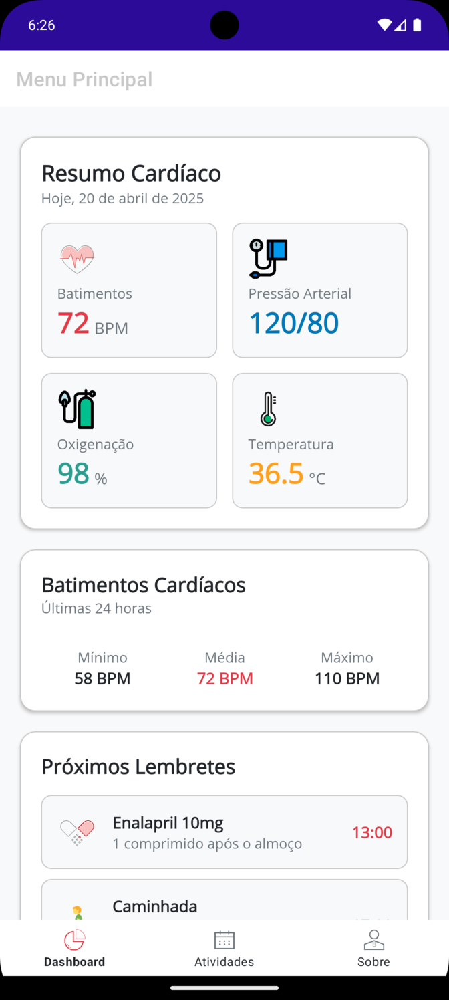
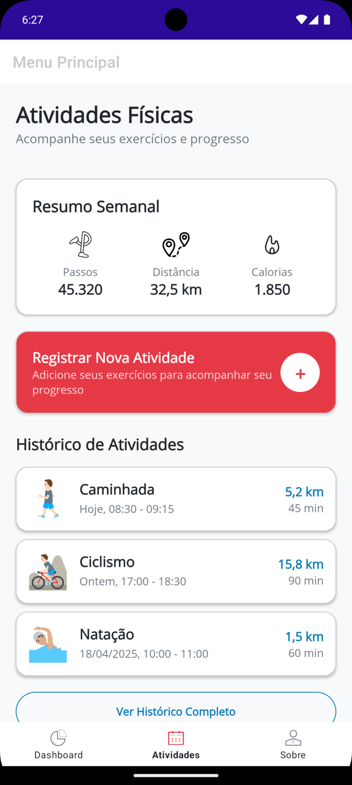
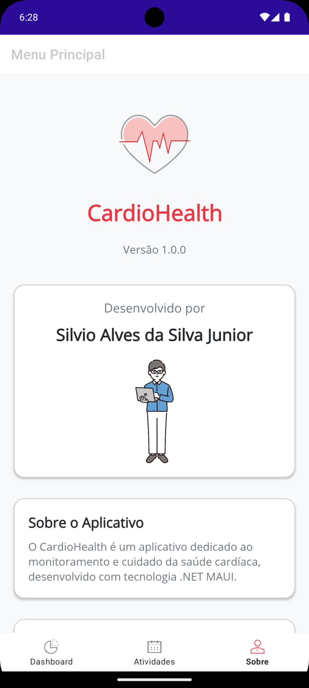

# CardioHealth

CardioHealth é um aplicativo multiplataforma desenvolvido em .NET MAUI para monitoramento e acompanhamento da saúde cardíaca.

## 📱 Capturas de Tela

### Tela de Boas-vindas/Login

### Dashboard

### Atividades

### Sobre

## 🚀 Como Executar

### Pré-requisitos

 - .NET 9 SDK ou superior
 - Visual Studio 2022 ou superior (com suporte ao .NET MAUI)
 - Emulador Android/iOS ou dispositivo físico

## 👨‍💻 Desenvolvedor
 - Silvio Alves da Silva Junior
 - E-mail: silvio.silva21@fatec.sp.gov.br

## 🤝 Contribuição

Contribuições são bem-vindas! 

Sinta-se à vontade para abrir issues, enviar pull requests ou sugerir melhorias.

## ⚠️ Aviso
Este aplicativo é apenas para fins educacionais e não substitui acompanhamento médico profissional.

> Feito com ❤️ em .NET MAUI

Se precisar de ajustes ou quiser incluir instruções específicas, é só pedir!
